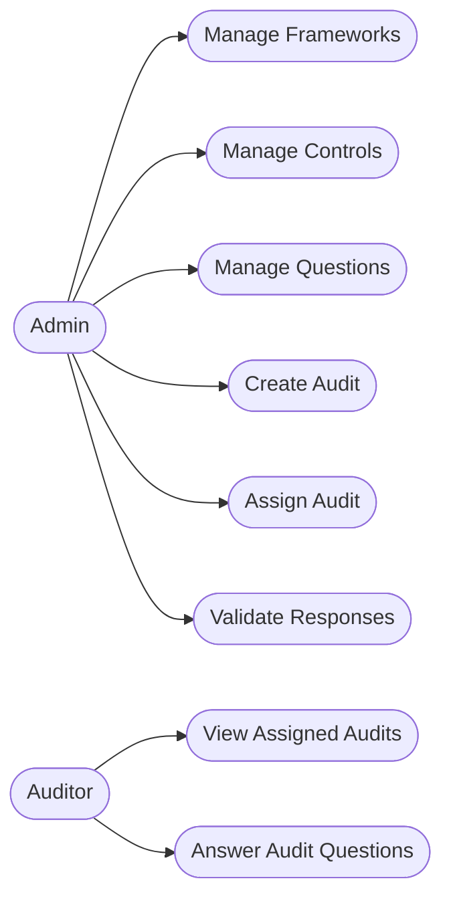
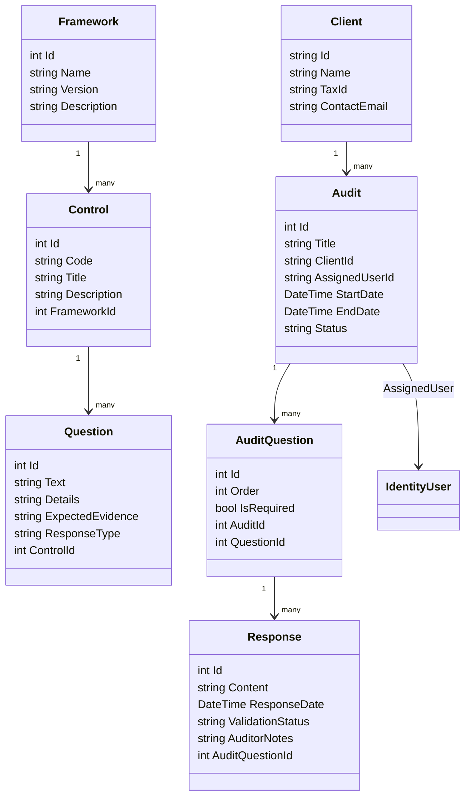
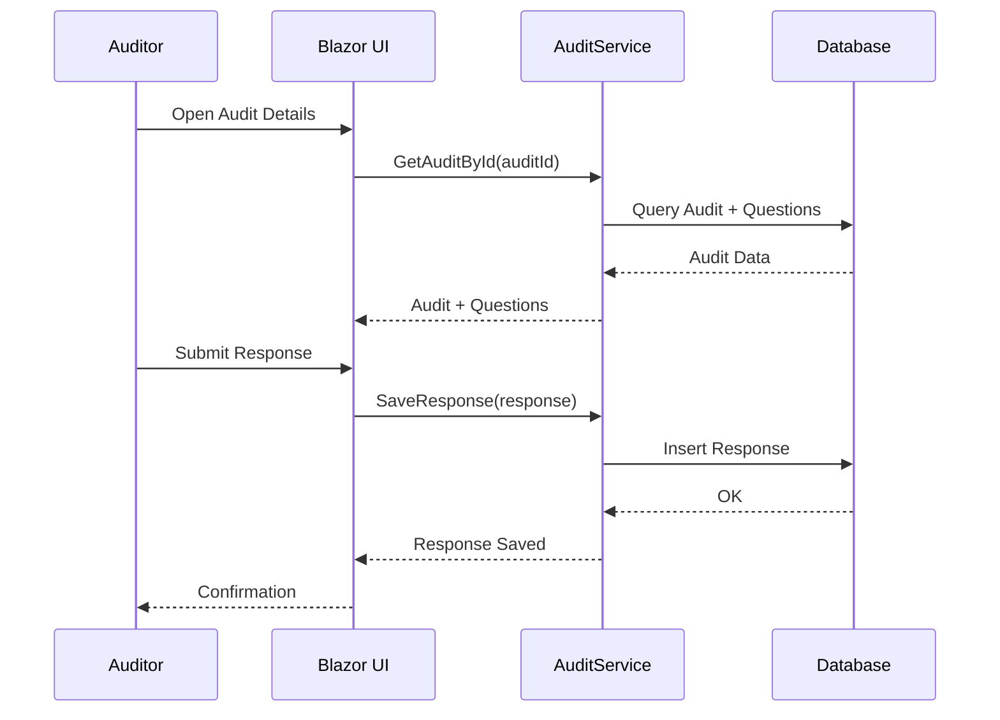
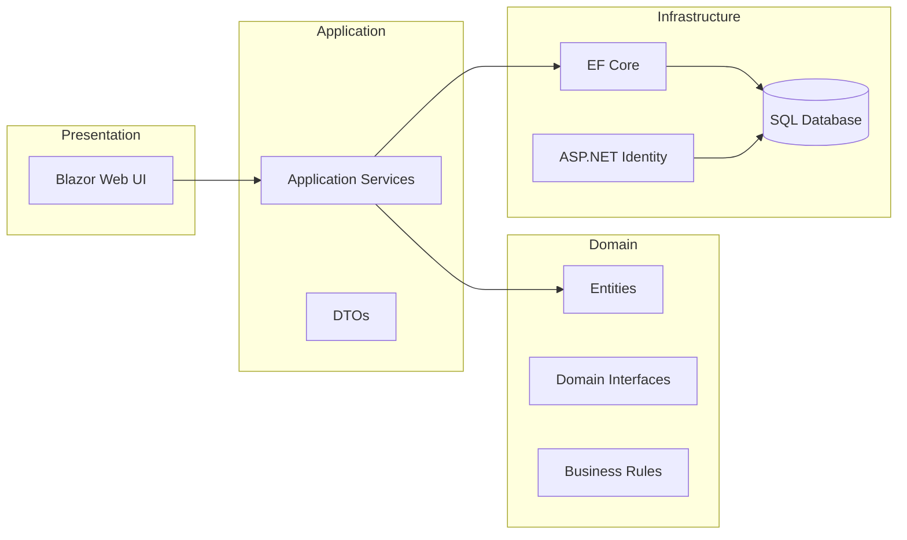

## Caso de uso

```mermaid
flowchart LR

    Admin([Admin])
    Auditor([Auditor])

    UC1([Manage Frameworks])
    UC2([Manage Controls])
    UC3([Manage Questions])
    UC4([Create Audit])
    UC5([Assign Audit])
    UC6([View Assigned Audits])
    UC7([Answer Audit Questions])
    UC8([Validate Responses])

    Admin --> UC1
    Admin --> UC2
    Admin --> UC3
    Admin --> UC4
    Admin --> UC5
    Admin --> UC8

    Auditor --> UC6
    Auditor --> UC7
```

## Diagrama de Classe

```mermaid
classDiagram
    class Framework {
        int Id
        string Name
        string Version
        string Description
    }

    class Control {
        int Id
        string Code
        string Title
        string Description
        int FrameworkId
    }

    class Question {
        int Id
        string Text
        string Details
        string ExpectedEvidence
        string ResponseType
        int ControlId
    }

    class Client {
        string Id
        string Name
        string TaxId
        string ContactEmail
    }

    class Audit {
        int Id
        string Title
        string ClientId
        string AssignedUserId
        DateTime StartDate
        DateTime EndDate
        string Status
    }

    class AuditQuestion {
        int Id
        int Order
        bool IsRequired
        int AuditId
        int QuestionId
    }

    class Response {
        int Id
        string Content
        DateTime ResponseDate
        string ValidationStatus
        string AuditorNotes
        int AuditQuestionId
    }

    Framework "1" --> "many" Control
    Control "1" --> "many" Question
    Client "1" --> "many" Audit
    Audit "1" --> "many" AuditQuestion
    AuditQuestion "1" --> "many" Response
    Audit --> IdentityUser : AssignedUser

```

## Sequencias

```mermaid
sequenceDiagram
    participant A as Auditor
    participant UI as Blazor UI
    participant S as AuditService
    participant DB as Database

    A->>UI: Open Audit Details
    UI->>S: GetAuditById(auditId)
    S->>DB: Query Audit + Questions
    DB-->>S: Audit Data
    S-->>UI: Audit + Questions

    A->>UI: Submit Response
    UI->>S: SaveResponse(response)
    S->>DB: Insert Response
    DB-->>S: OK
    S-->>UI: Response Saved
    UI-->>A: Confirmation

```

## Arquitetura

```mermaid
flowchart LR

    subgraph Presentation
        Blazor[Blazor Web UI]
    end

    subgraph Application
        Services[Application Services]
        DTOs[DTOs]
    end

    subgraph Domain
        Entities[Entities]
        Interfaces[Domain Interfaces]
        Rules[Business Rules]
    end

    subgraph Infrastructure
        EF[EF Core]
        Identity[ASP.NET Identity]
        DB[(SQL Database)]
    end

    Blazor --> Services
    Services --> Entities
    Services --> EF
    EF --> DB
    Identity --> DB

```

