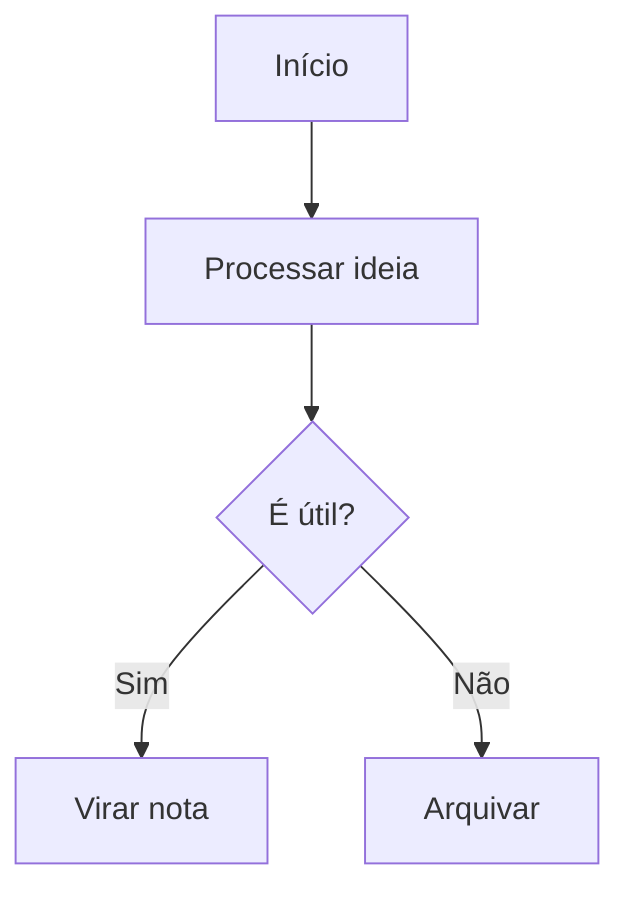
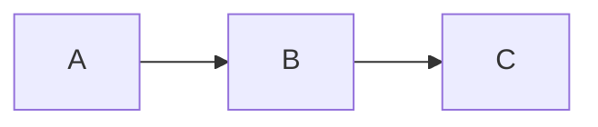
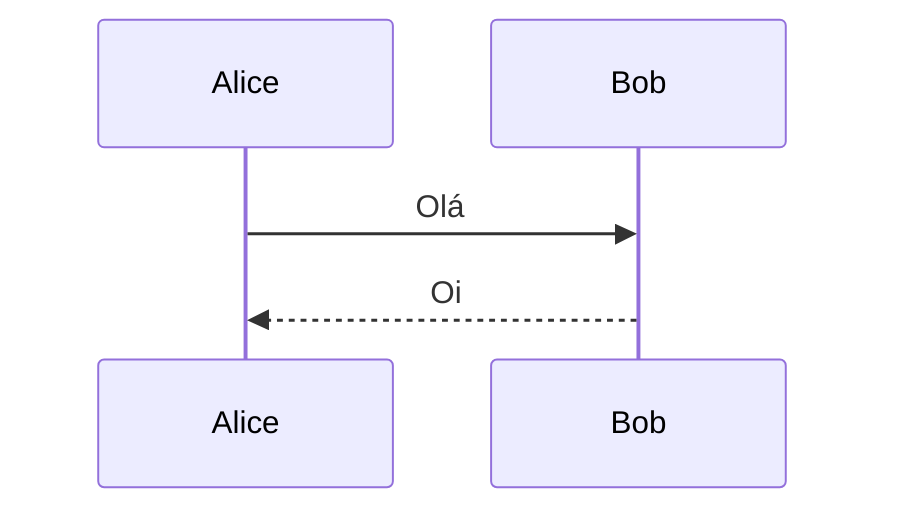
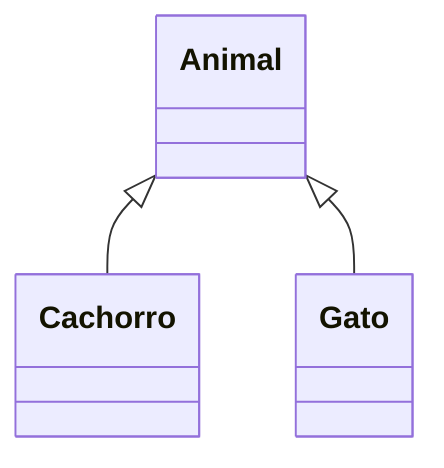
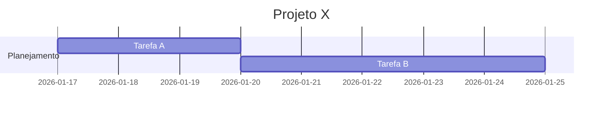
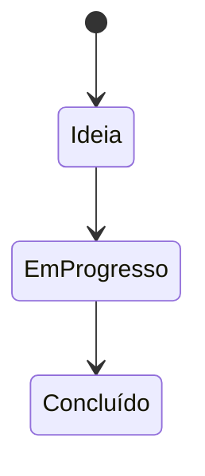
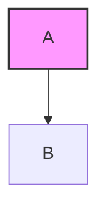
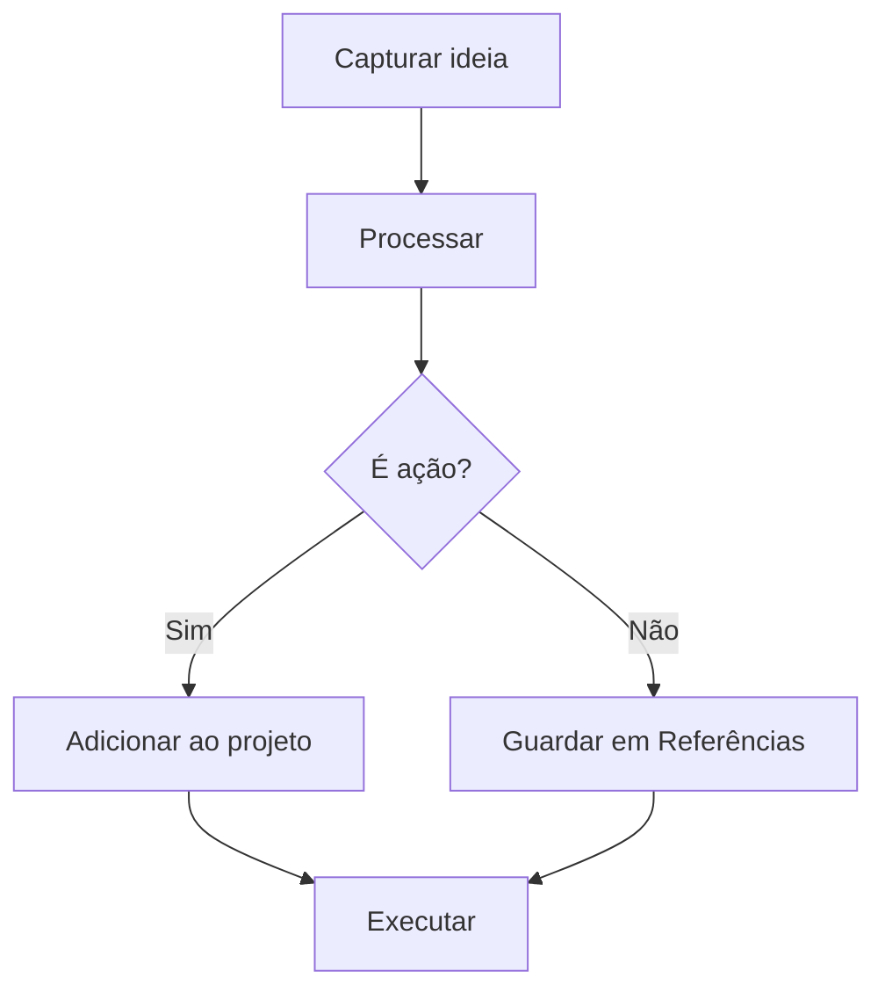

## Introdução

Gosto de usar Mermaid no Obsidian porque ele me permite transformar ideias em desenhos simples e rápidos sem sair do Markdown. Sempre que preciso visualizar um processo, organizar um fluxo ou entender melhor uma estrutura, crio um diagrama aqui mesmo. Esta página é meu espaço de referência para lembrar como escrever cada tipo de diagrama e ter exemplos prontos para copiar quando precisar.

## 🟦 1. Criar um bloco Mermaid

Basta abrir um bloco de código com `mermaid`:

markdown

````

````

Quando você fecha o bloco, o Obsidian renderiza automaticamente o diagrama.

## 🟦 2. Tipos de diagramas que você pode criar

### 🔹 Fluxogramas (graph)

markdown

````

````

### 🔹 Diagramas de sequência

markdown

````

````

### 🔹 Diagramas de classe

markdown

````

````

### 🔹 Diagramas de Gantt (cronogramas)

markdown

````

````

### 🔹 Diagramas de estado

markdown

````

````

## 🟦 3. Ativar suporte ao Mermaid (se não estiver funcionando)

Normalmente já vem ativado, mas caso não:

1. Vá em **Settings → Editor**
    
2. Ative **“Show code block preview”**
    
3. Vá em **Settings → Appearance**
    
4. Ative **“Enable Mermaid diagrams”**
    

Pronto, tudo renderiza automaticamente.

## 🟦 4. Dicas para deixar seus diagramas mais bonitos

- Use `LR` (left-to-right) ou `TD` (top-down) para controlar o fluxo
    
- Use colchetes para formas diferentes:
    
    - `A[Retângulo]`
        
    - `A(Rounded)`
        
    - `A{Decisão}`
        
    - `A((Círculo))`
        
- Use cores com `style`:
    

markdown

````

````

## 🟦 5. Exemplo completo para você copiar

markdown

````

````

## Referencias
### Internas
```dataview
list
from [[]]
```

### Links
```dataview
table
title as Titulo, length(file.inlinks) as Referencias, tags as Tags
from [[]]
```
